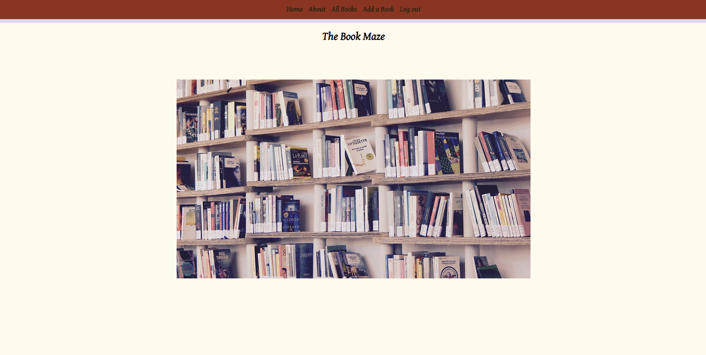
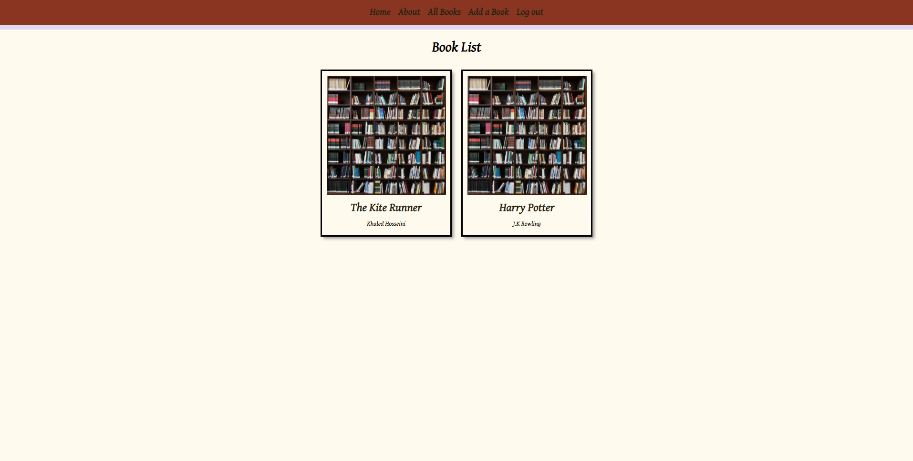

# The Book Maze

## Objective
+ Build a full-stack application using a python based Django web framework that enables the user to add their favorite books along with a description about the book and why it's their favorite. 

## Motivation 
+ As an avid reader, I wanted to build an app that I would practically be using too.Sometimes you just need to rant about a book you've just read and why you really enjoyed it so this app allows you to do exactly that-a book tracker app of all your favorite books.  

## Getting Started: 
+ Click [here](https://the-book-maze.herokuapp.com/) to go to the application. 

## View

### Trello Board
[Trello](https://trello.com/b/igWiWrwU/the-book-maze#) 

Final outloook of the application

## Technology Implemented:
+ boto3
+ dj-database-url
+ Django
+ django-environ
+ django-on-heroku
+ gunicorn
+ Pillow
+ psycopg2-binary
+ python-dotenv
+ HTML
+ CSS
+ Git

## Credits
Images from [Pixaby](https://pixabay.com/)

## Stretch Goals
+ Make the application more community friendly where users can see books added by other users.
+ Add a forum like page where users can interact and talk about their favorite books with one another.